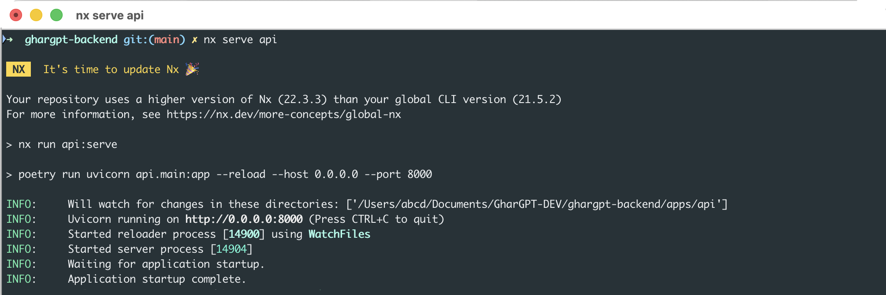
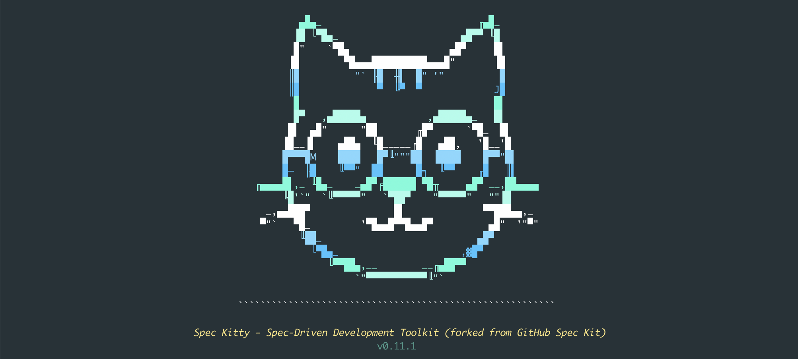

# GharGPT Backend

This repository contains the backend platform for **GharGPT**, built using **Nx (v22.3.3)** as a scalable monorepo foundation. This README documents the initial setup, tooling decisions, and next steps so contributors can quickly understand and extend the platform.

---

## 1. Workspace Initialization

The backend workspace was initialized using **Nx (v22.3.3)** with an applications-first preset.

### Step 1: Create Nx Workspace

```bash
npx create-nx-workspace@latest ghargpt-backend --preset=apps --packageManager=npm
```

### Step 2: Install Nx Python Plugin

```bash
npm install -D @nxlv/python
poetry env use python3.11
```

This installs the Nx Python plugin required to generate and manage Python applications inside the Nx workspace.

### Step 3: Generate FastAPI Application

```bash
nx g @nxlv/python:poetry-project api \
  --projectType=application \
  --framework=fastapi \
  --directory=apps/api
```

• Creates an Nx application named api
• Uses Poetry for dependency management
• Bootstraps a FastAPI project
• Sets the project root explicitly to apps/api

```
CREATE apps/api/project.json
CREATE apps/api/README.md
CREATE apps/api/.python-version
CREATE apps/api/api/__init__.py
CREATE apps/api/api/hello.py
CREATE apps/api/poetry.toml
CREATE apps/api/pyproject.toml
CREATE apps/api/tests/__init__.py
CREATE apps/api/tests/conftest.py
CREATE apps/api/tests/test_hello.py
CREATE apps/api/.flake8
```

### Step 4: Project structure

```text
ghargpt-backend/
├── apps/
│   └── api/                         # FastAPI application (Nx project)
│       ├── api/                     # Python package (application code)
│       │   ├── __init__.py
│       │   └── hello.py             # Sample FastAPI endpoint
│       ├── tests/                   # Pytest test suite
│       │   ├── __init__.py
│       │   ├── conftest.py
│       │   └── test_hello.py
│       ├── project.json             # Nx project configuration
│       ├── pyproject.toml           # Poetry project definition
│       ├── poetry.toml              # Poetry configuration
│       ├── .python-version          # Python runtime version
│       ├── .flake8                  # Linting configuration
│       └── README.md                # API-specific documentation
├── docs/
│   └── images/
│       └── nx_serve_api.png         # Nx serve API screenshot
├── libs/                            # Shared libraries (mongodb-serve, future libs)
├── tools/                           # Workspace tooling
├── .github/                         # CI workflows
├── nx.json                          # Nx configuration
├── package.json                     # Workspace dependencies
├── package-lock.json                # Dependency lockfile
└── README.md                        # Workspace documentation
```

### Step 5: Run the application

```bash
nx serve api
```



## Spec-Kitty Configuration

```
https://github.com/Priivacy-ai/spec-kitty
```

### Step 1: Specification Driven Development setup

```bash
python -m venv ghargpt-env
source bin/activate

➜  ghargpt-env git:(main) ✗ pwd
/Users/abcd/Documents/GharGPT-DEV/ghargpt-backend/ghargpt-env
➜  ghargpt-env git:(main) ✗ source bin/activate
(ghargpt-env) ➜  ghargpt-env git:(main) ✗
```



### Step 2: Spec-Kitty Initialization

```bash
/Users/abcd/Documents/GharGPT-DEV/ghargpt-backend/ghargpt-env/bin/spec-kitty . init
```

### Step 3: Feature development using Spec-Kitty

```bash
 /Users/abcd/Documents/GharGPT-DEV/ghargpt-backend/ghargpt-env/bin/spec-kitty agent feature create-feature "gharApi_v0_001"
```

Update the "kitty-specs/001-gharApi_v0_001/spec.md" with feature requirement and acceptance criteria.
